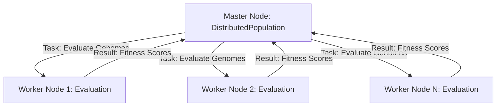

# NEATify Distributed Systems Guide

This guide covers everything you need to know about running **NEATify** in a distributed environment. By leveraging multiple computing nodes, you can significantly accelerate the evolutionary process, especially for complex fitness evaluations.

---

## 📑 Table of Contents
1. [Architecture Overview](#-architecture-overview)
2. [Configuration: DistributedConfig](#-configuration-distributedconfig)
3. [Master Node Setup](#-master-node-setup)
4. [Worker Node Setup](#-worker-node-setup)
5. [Complete Example: Distributed XOR](#-complete-example-distributed-xor)
6. [Best Practices](#-best-practices)
7. [Troubleshooting](#-troubleshooting)

---

## 🏗️ Architecture Overview

NEATify uses a **Master-Worker** architecture designed for LAN environments:

- **Master Node**: 
  - Maintains the global population.
  - Performs genetic operations (speciation, crossover, mutation).
  - Distributes genome batches to workers.
  - Aggregates fitness results.
- **Worker Node**:
  - Connects to the Master.
  - Hosts the actual **Fitness Function**.
  - Receives genome batches, evaluates them, and reports scores back.



---

## ⚙️ Configuration: DistributedConfig

The `DistributedConfig` class controls the network behavior of your distributed run.

| Parameter | Default | Description |
|-----------|---------|-------------|
| `host` | `'0.0.0.0'` | Host address the Master listens on. |
| `port` | `5000` | Port for communication. |
| `min_workers`| `1` | Minimum workers required before evolution starts. |
| `heartbeat_interval`| `5.0` | Seconds between health checks. |
| `task_timeout` | `300.0` | Max seconds allowed for a worker to evaluate a batch. |

**Example:**
```python
from neatify.distributed import DistributedConfig

d_config = DistributedConfig(
    host='0.0.0.0', 
    port=5000, 
    min_workers=4,
    task_timeout=600.0
)
```

---

## 👑 Master Node Setup

The Master node uses `DistributedPopulation` instead of the standard `Population`.

```python
from neatify.distributed import DistributedPopulation, DistributedConfig

# 1. Setup Distributed Config
d_config = DistributedConfig(min_workers=2)

# 2. Initialize Distributed Population
pop = DistributedPopulation(
    pop_size=150, 
    num_inputs=2, 
    num_outputs=1, 
    distributed_config=d_config
)

# 3. Run evolution
# NOTE: The fitness function itself is NOT needed here. 
# Workers handle the evaluation.
for gen in range(100):
    pop.run_generation(lambda g: None) # Pass a dummy function
    best = max(pop.genomes, key=lambda g: g.fitness)
    print(f"Gen {gen}: Best {best.fitness}")

pop.shutdown()
```

---

## 👷 Worker Node Setup

Workers are responsible for the heavy lifting. They must have the fitness function defined.

```python
from neatify.distributed import WorkerNode
import torch

def my_fitness_fn(genomes):
    # Your standard evaluation logic here
    for g in genomes:
        g.fitness = ... 

# Initialize and start
worker = WorkerNode(
    master_host='192.168.1.10', # Master IP
    master_port=5000,
    worker_id=1,
    fitness_function=my_fitness_fn
)

worker.start() # This blocks and keeps the worker running
```

---

## ⚡ Complete Example: Distributed XOR

### Terminal 1: The Master
```python
# master_script.py
from neatify.distributed import DistributedPopulation, DistributedConfig

pop = DistributedPopulation(
    pop_size=150, num_inputs=2, num_outputs=1,
    distributed_config=DistributedConfig(min_workers=2)
)

for gen in range(50):
    pop.run_generation(lambda g: None)
    best = max(pop.genomes, key=lambda g: g.fitness)
    if best.fitness > 3.9: break

pop.shutdown()
```

### Terminal 2+ (Nodes): The Workers
```python
# worker_script.py
from neatify.distributed import WorkerNode
from neatify import NeatModule
import torch

def xor_fitness(genomes):
    X = torch.tensor([[0,0], [0,1], [1,0], [1,1]], dtype=torch.float32)
    Y = torch.tensor([[0], [1], [1], [0]], dtype=torch.float32)
    for g in genomes:
        model = NeatModule(g)
        mse = torch.mean((model(X) - Y)**2).item()
        g.fitness = 4.0 - mse

worker = WorkerNode('localhost', 5000, 1, xor_fitness)
worker.start()
```

---

## 💡 Best Practices

1. **Deterministic Fitness**: Ensure your fitness function yields consistent results across different workers.
2. **Network latency**: For very fast evaluations (like XOR), the network overhead might be higher than the computation time. Use distributed systems primarily for heavy tasks (Gym environments, deep network evaluations).
3. **Batch Sizing**: Let the Master handle the batching. Larger populations benefit more from more workers.
4. **Environment Consistency**: Ensure all worker nodes have the same library versions and dependencies installed.

---

## ❓ Troubleshooting

- **"Waiting for workers..."**: Ensure the Master is reachable. Double-check firewalls and the `master_host` IP.
- **Worker registration fails**: Ensure `worker_id` is unique if running multiple instances on one machine.
- **Timeouts**: If evaluations take a long time, increase `task_timeout` in the `DistributedConfig`.
- **Import Errors**: Make sure `neatify` is installed or in the `PYTHONPATH` on all participating machines.

---

Happy Distributed Evolving! 🌐🚀
